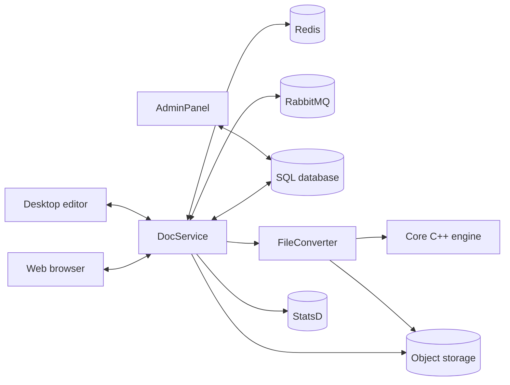

# Architecture

{{ brand.name }} is a microservice-style platform. The diagram below shows the
high-level component layout for a typical single-node deployment.

## Backend services

| Service | Role | Default port |
|---|---|---|
| **DocService** | Real-time collaboration, Socket.io transport, document session orchestration. | 8080 |
| **FileConverter** | Wraps native C++ converters for format translation. | — |
| **AdminPanel** | License management and system monitoring UI. | 9000 |
| **Metrics** | StatsD-based metrics emission. | — |

All four are Node.js processes living in the [`server` repository](components.md).

## External dependencies

- **Redis** — Session state and real-time coordination.
- **RabbitMQ** — Inter-service messaging.
- **SQL database** — One of MySQL, PostgreSQL, MSSQL, or Oracle.
- **Object storage** *(optional)* — S3-compatible or Azure Blob; falls back to local filesystem.

A configuration section covering the setup of each will follow.

## Frontend

Editors are vanilla JavaScript with RequireJS modules — no React/Vue/Angular —
built per document type and served as static assets. See
[components → web-apps](components.md).

## Native core

A C++ rendering and conversion engine. Output artifacts are consumed by
FileConverter at runtime. See [components → core](components.md).

## Scaling out

For multi-node deployments DocService, FileConverter, and storage scale
horizontally behind a load balancer; Redis and RabbitMQ are clustered, and
the SQL database is replicated. An upcoming high-availability configuration
page will cover the topology in depth.
