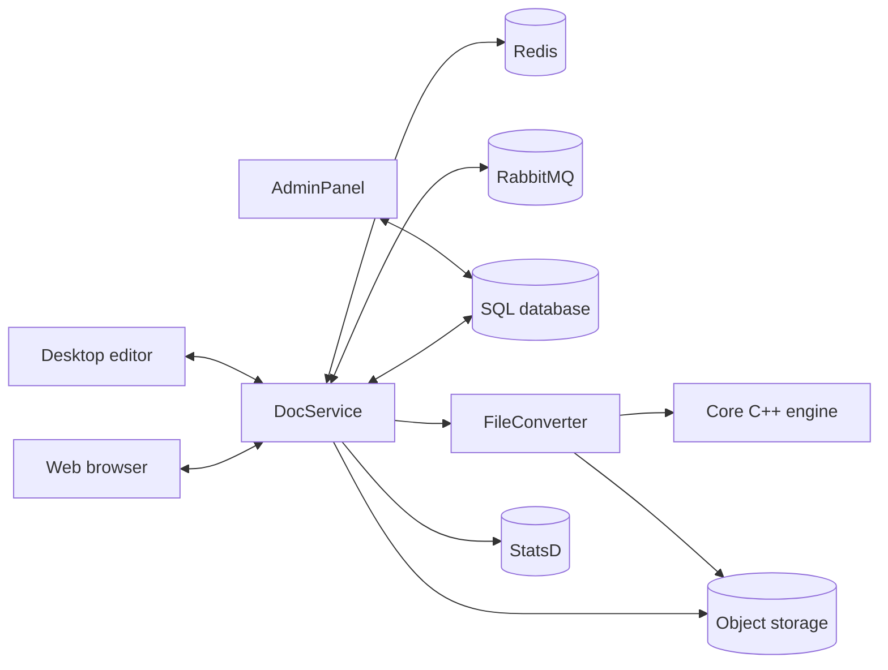

# Architecture

{{ brand.name }} is a microservice-style platform. The diagram below shows the
high-level component layout for a typical single-node deployment.



## Backend services

| Service | Role | Default port |
|---|---|---|
| **DocService** | Real-time collaboration, Socket.io transport, document session orchestration. | 8080 |
| **FileConverter** | Wraps native C++ converters for format translation. | — |
| **AdminPanel** | License management and system monitoring UI. | 9000 |
| **Metrics** | StatsD-based metrics emission. | — |

All four are Node.js processes living in the [`server` repository](components.md).

## External dependencies

- **Redis** — Session state and real-time coordination.
- **RabbitMQ** — Inter-service messaging.
- **SQL database** — One of MySQL, PostgreSQL, MSSQL, or Oracle.
- **Object storage** *(optional)* — S3-compatible or Azure Blob; falls back to local filesystem.

A configuration section covering the setup of each will follow.

## Frontend

Editors are vanilla JavaScript with RequireJS modules — no React/Vue/Angular —
built per document type and served as static assets. See
[components → web-apps](components.md).

## Native core

A C++ rendering and conversion engine. Output artifacts are consumed by
FileConverter at runtime. See [components → core](components.md).

## Editing session lifecycle

Opening and saving a document is a fully decoupled, asynchronous flow between the
storage host (e.g. Nextcloud), the user's browser, and the document server:

```mermaid
sequenceDiagram
    participant NC as Storage host<br/>(+ integration app)
    participant B as Browser (editor)
    participant DS as DocService
    participant CV as FileConverter
    NC->>B: 1. Open doc — signed JWT (permissions, metadata, CallbackUrl) in an iframe
    B->>DS: 2. Load editor assets (web-apps) + engine (sdkjs)
    DS->>NC: 3a. Download source file (JWT-authorized)
    B-->>DS: 3b. Edits stream over WebSocket (Socket.io)
    Note over DS: changesets held in Redis;<br/>inter-service coordination via RabbitMQ
    Note over DS: last client leaves → grace timer
    DS->>CV: 4a. Apply changesets, repack to native format
    DS->>NC: 4b. POST to CallbackUrl
    Note over NC: validate signature → write new file version
```

1. **Initialization & JWT.** When a user opens a document, the storage host's
   integration app issues a **JWT** signed with the shared secret, carrying the user's
   permissions, file metadata and a `CallbackUrl`, and embeds an `iframe` pointing at the
   document server.
2. **Asset loading.** The browser loads the editor UI (`web-apps`) and the document
   engine (`sdkjs`) from the document server; the editor initializes under the global
   `Asc` namespace.
3. **Live editing.** DocService downloads the source file from storage using the JWT,
   then exchanges edits with the browser as **changesets** over a WebSocket
   (Socket.io). Session state is kept in **Redis** and inter-service messaging goes
   through **RabbitMQ**, so collaborators see each other's edits without disk round-trips.
4. **Save & persistence.** After the last client disconnects (plus a short grace timer),
   **FileConverter** applies the accumulated changesets and repacks the native binary;
   DocService then POSTs it to the `CallbackUrl`, and the storage host validates the
   signature and stores a new file version.

## Scaling out

For multi-node deployments DocService, FileConverter, and storage scale
horizontally behind a load balancer; Redis and RabbitMQ are clustered, and
the SQL database is replicated. An upcoming high-availability configuration
page will cover the topology in depth.
